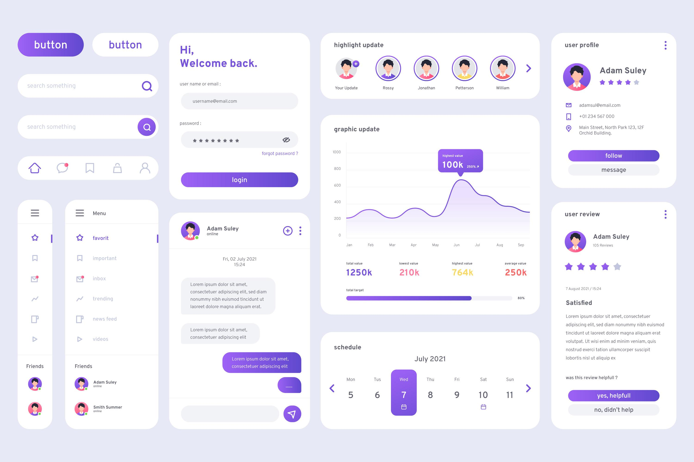
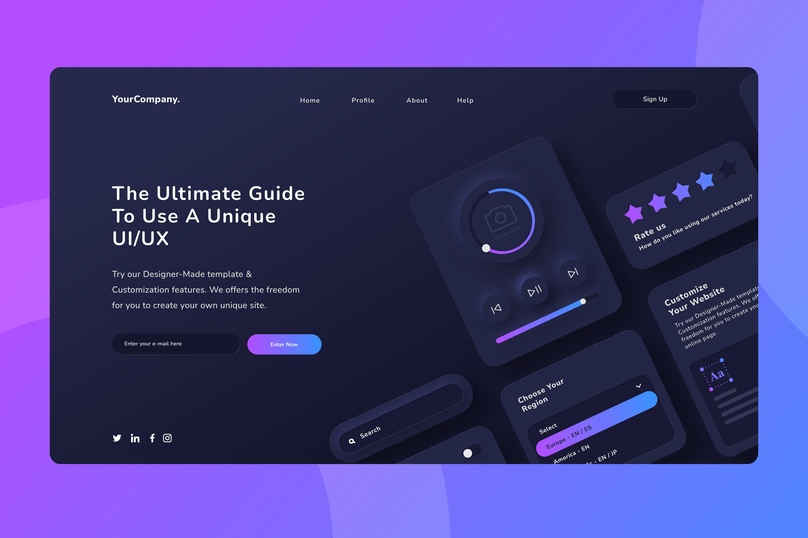
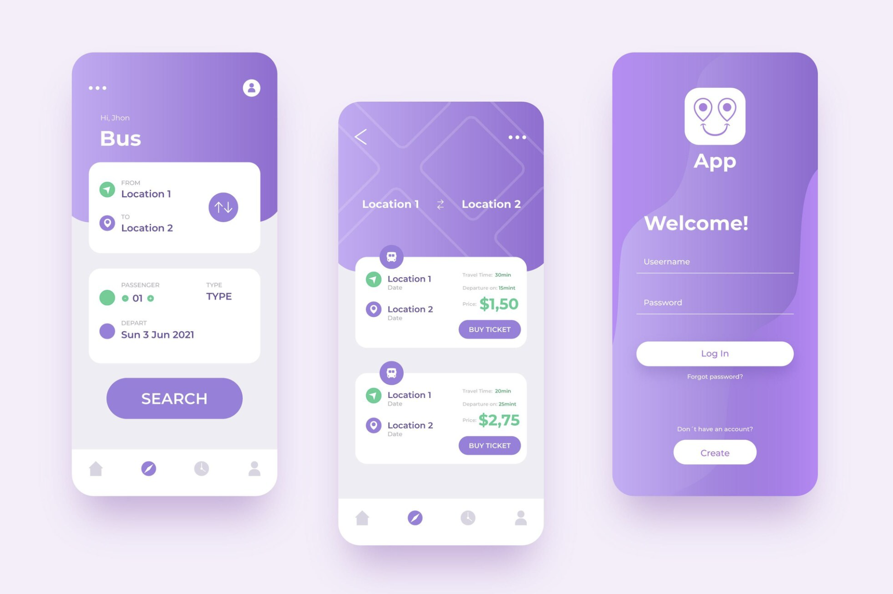

# awesome-ai-ui-design-themes

UI Design Themes for Claude Code, Codex, Cursor, Copilot, Opencode, and more.

Drop a `THEME.md` into your project root and let your AI coding agent build beautiful, consistent UI.

---

## Themes

<table>
  <tr>
    <td align="center" width="50%">
       
      <b>Dark Explorer</b> 
      <a href="themes/0001">Use Theme →</a>
    </td>
    <td align="center" width="50%">
       
      <b>Soft Violet</b> 
      <a href="themes/0002">Use Theme →</a>
    </td>
  </tr>
  <tr>
    <td align="center" width="50%">
       
      <b>Neon Cosmos</b> 
      <a href="themes/0003">Use Theme →</a>
    </td>
    <td align="center" width="50%">
       
      <b>Lavender Breeze</b> 
      <a href="themes/0004">Use Theme →</a>
    </td>
  </tr>
</table>

---

## How to Use

1. Browse the themes above and pick one you like
2. Go to the theme folder and download the `THEME.md` file
3. Place `THEME.md` in the **root** of your application project
4. Ask your AI coding agent to follow the design guidelines in `THEME.md` when building UI

Works with **Claude Code**, **Codex**, **Cursor**, **GitHub Copilot**, **Opencode**, and any AI agent that reads project files.

---

## Contributing

Want to add your own theme? Check out [CONTRIBUTING.md](CONTRIBUTING.md) for guidelines and the required `THEME.md` structure.
